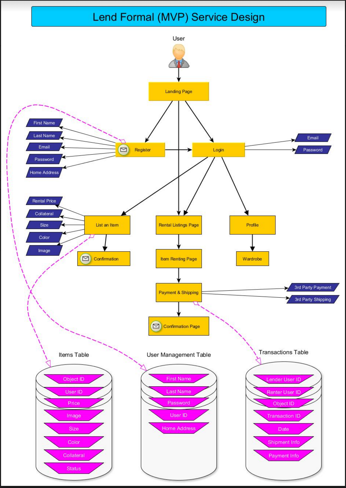
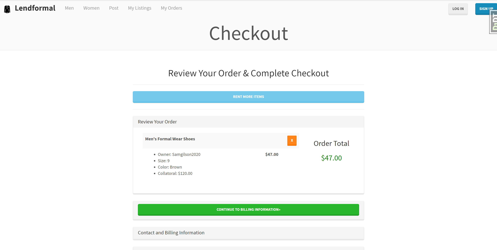

# Lendformal

Lendformal is a website where users can lend and rent out their formal clothing. It is built with [Python][0] using the [Django Web Framework][1].

## Project Design

## Application Screenshots

## Installation - Quick start

To set up a development environment quickly, first install Python 3. It
comes with virtualenv built-in. So create a virtual env by:

    1. `$ python3 -m venv Lendformal`
    2. `$ . Lendformal/bin/activate`

Install all dependencies:

    pip install -r requirements.txt

Run migrations:

    python manage.py migrate

### Detailed instructions

Take a look at the docs for more information.

[0]: https://www.python.org/
[1]: https://www.djangoproject.com/
